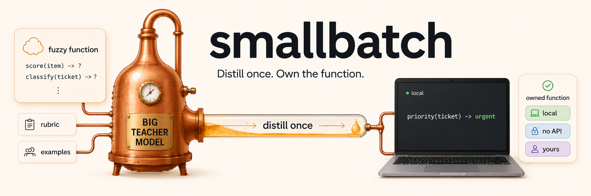

<p align="center">
  
</p>

*Small-batch distillation: compile a frontier model's ability on one narrow
task into a small model you own.*

Lots of useful functions are fuzzy: *score this item 0–10 against a rubric*,
*classify this ticket as urgent/normal/low*. A frontier model does these well
from a prompt — so teams end up renting one forever for a task that never
changes: every call costs money, takes seconds, hits rate limits, and sends
your data to someone else's computer.

smallbatch turns that prompt into a function you own. It uses the big model
**once**, as a teacher to label your real examples, then trains a small model
that runs on almost any hardware (typically under 2B parameters) to do that
one job. After that the function is yours: no per-call cost, no rate limits,
no network dependency, your data stays local, milliseconds per call — and a
fraction of the energy per call that frontier-model inference burns.

The whole loop — spec → teacher-labeled data → small-model training → quality
check → callable function — is open source and runs from one YAML file on
your own machine. You choose the teacher (any `/chat/completions` endpoint,
including a local Ollama model, or the Claude Code CLI). You choose the
student — any open-weights model — and train it on whatever GPU you have,
your own or a rented spot instance. No platform, no account, no production
traffic required: just a spec and some example items.

Outputs are deliberately constrained — an integer in a range or one label
from a fixed list. That narrowness is the point: it's the regime where a
small student genuinely matches its teacher, it makes quality measurable, and
it keeps compiled functions squarely in "specialized classifier" territory
(see [Responsible use](#responsible-use)).

## Install

```bash
pip install smallbatch            # + [qlora] for 4-bit training of 3-9B bases
```

Training needs a CUDA GPU — a few minutes on any card for the default-size
student ([docs/local-gpu.md](docs/local-gpu.md)), or rent one per compile
([docs/cloud.md](docs/cloud.md)). Match your torch build to your GPU — old
and very new cards both need specific wheels ([details](docs/local-gpu.md)).

## Quickstart

A complete runnable example ships in
[`examples/ticket-priority/`](examples/ticket-priority/) — a support-ticket
priority classifier with 71 bundled synthetic tickets and a zero-API-key
teacher config (local Ollama):

```bash
# 1. the teacher labels the items into a train/holdout dataset
smallbatch label examples/ticket-priority/spec.yaml \
    --items examples/ticket-priority/items.json

# 2. train + quality-check -> artifacts/ticket-priority/<date>/
smallbatch compile examples/ticket-priority/spec.yaml

# 3. call it
smallbatch run ticket-priority --json '{"subject": "Site down", "body": "...", "product_area": "auth", "customer_tier": "pro"}'
smallbatch status        # list compiled functions, quality verdicts, staleness
```

Or from Python:

```python
import json, smallbatch

items = json.load(open("examples/ticket-priority/items.json"))
smallbatch.label("examples/ticket-priority/spec.yaml", items)
result = smallbatch.compile("examples/ticket-priority/spec.yaml")   # CompileResult
fn = smallbatch.load_fn("ticket-priority")
fn({"subject": "Site down", "body": "...", "product_area": "auth", "customer_tier": "pro"})
# -> "urgent"
```

## What you get

- **A spec, not a script.** One diffable YAML file defines the function:
  input fields, output contract, and the rubric the teacher labels by. The
  spec (plus any files it references) is content-hashed, so a deployed
  function knows when its definition has drifted.
- **Honest quality verdicts.** Every compile is scored against held-out
  teacher labels and against the untrained base model, and the artifact
  records a pass/fail verdict; `load_fn` refuses failing adapters by default.
  Decoding is constrained to the output contract, so the function can't
  return garbage — only a right or wrong answer.
  Exit codes are automation-friendly: **0** pass, **2** honest fail, **1**
  error.
- **Small artifacts, shared base.** Training uses LoRA adapters — each
  compiled function is tens of MB layered on one frozen base model, so ten
  functions don't cost ten models of disk or RAM.
- **Runs anywhere once compiled.** `smallbatch export <fn>` merges and
  quantizes the function into a single GGUF file (~230MB for the default
  base) with an Ollama Modelfile and a llama.cpp grammar generated from the
  output contract — CPU-only inference where invalid outputs are impossible
  by construction, no Python required
  ([details](docs/how-it-works.md#exporting-to-a-zero-pytorch-runtime)).
- **A model picker built in.** `smallbatch sweep` runs a `(base model) ×
  (technique)` grid, each cell in an isolated subprocess so one OOM can't
  poison the rest, and writes a comparison table. Finding the smallest model
  that clears your bar is a one-command experiment
  ([details](docs/how-it-works.md#sweeps)).

## Does it work?

Results from the pilot task — relevance-scoring news items 0–10 against an
editorial rubric, teacher = Claude Sonnet, n=22 real-item holdout:

| student (base model) | agreement ±1 | zero-shot base |
|---|---|---|
| LFM2.5-1.2B-Instruct | **81.8%** | 4.6% |
| MiniCPM5-1B | **81.8%** | 13.6% |
| Qwen3-0.6B-Base (2m43s on an 11GB card) | 77.3% | 0.0% |
| Qwen3.5-4B (4-bit, 12GB card) | 77.3% | 18.2% |

- The teacher's own self-agreement ceiling (relabeling the same items) was
  97.3% — a student at 81.8% has closed most of the gap from a zero-shot
  floor of ≤13.6%. **Compilation added +68–77 points of agreement.**
- These runs sat just under a strict 85% bar on a small n=22 holdout (one
  item ≈ 4.5 points) — the honest conclusion, recorded by the quality check
  itself, was "accumulate a bigger real holdout," not "ship it."
- Technique arms (DoRA, rationale distillation) never beat plain fine-tuning
  on this task. Model-agnosticism held: four different architectures compiled
  through the identical pipeline with zero code changes.

## Responsible use

smallbatch trains on teacher outputs, so **your teacher provider's terms
govern what you may build**. Constrained scorers/classifiers like these fit
the "specialized, non-competing tool" category that major providers expressly
allow (e.g. content categorization, sentiment, extraction) — but general
chatbots or open-ended generators trained on provider outputs are prohibited,
and some providers require prior authorization for any training use. Using a
self-hosted open-weights teacher (Ollama/vLLM) sidesteps the question for
labeling. Read [docs/responsible-use.md](docs/responsible-use.md) before
pointing a hosted teacher at a dataset.

Note also that an adapter inherits its **base model's** license — the default
student (`LiquidAI/LFM2.5-350M-Base`) ships under the LFM Open License, which
conditions commercial use above $10M annual revenue; swap the base in one
YAML line if that matters for you.

## Docs

| | |
|---|---|
| [docs/how-it-works.md](docs/how-it-works.md) | Pipeline, spec reference, teacher protocol, training/eval design, artifacts, the Program-as-Weights lineage. |
| [docs/local-gpu.md](docs/local-gpu.md) | Running on your own GPU: precision auto-select, VRAM sizing, old-GPU (Pascal) pins, OOM knobs. |
| [docs/cloud.md](docs/cloud.md) | Renting a GPU per compile with SkyPilot; the label-locally/compile-remotely split. |
| [docs/responsible-use.md](docs/responsible-use.md) | Provider-terms guidance for choosing a teacher. |
| [examples/ticket-priority/](examples/ticket-priority/) | Complete runnable example. |
| [ROADMAP.md](ROADMAP.md) | Where this is headed (GGUF export, constrained decoding, drift detection) — and what's deliberately out of scope. |

## Development

```bash
uv venv && source .venv/bin/activate
uv pip install -e .[dev]
pytest -q          # CPU-only; no GPU or network needed
```

MIT licensed. Inspired by
[Program-as-Weights (arXiv:2607.02512)](https://arxiv.org/abs/2607.02512) —
see [docs/how-it-works.md](docs/how-it-works.md#relationship-to-program-as-weights)
for what smallbatch borrows and what it deliberately doesn't.
